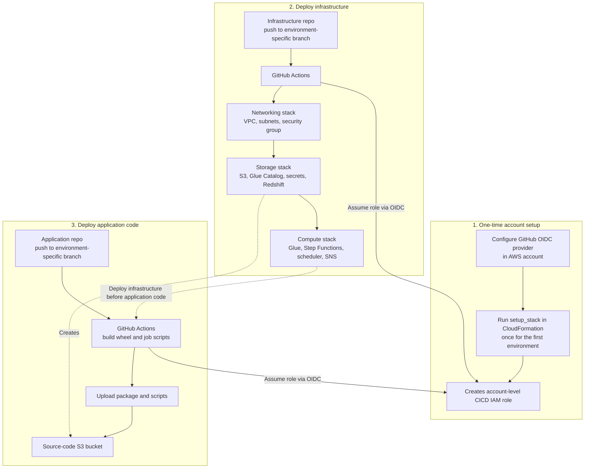
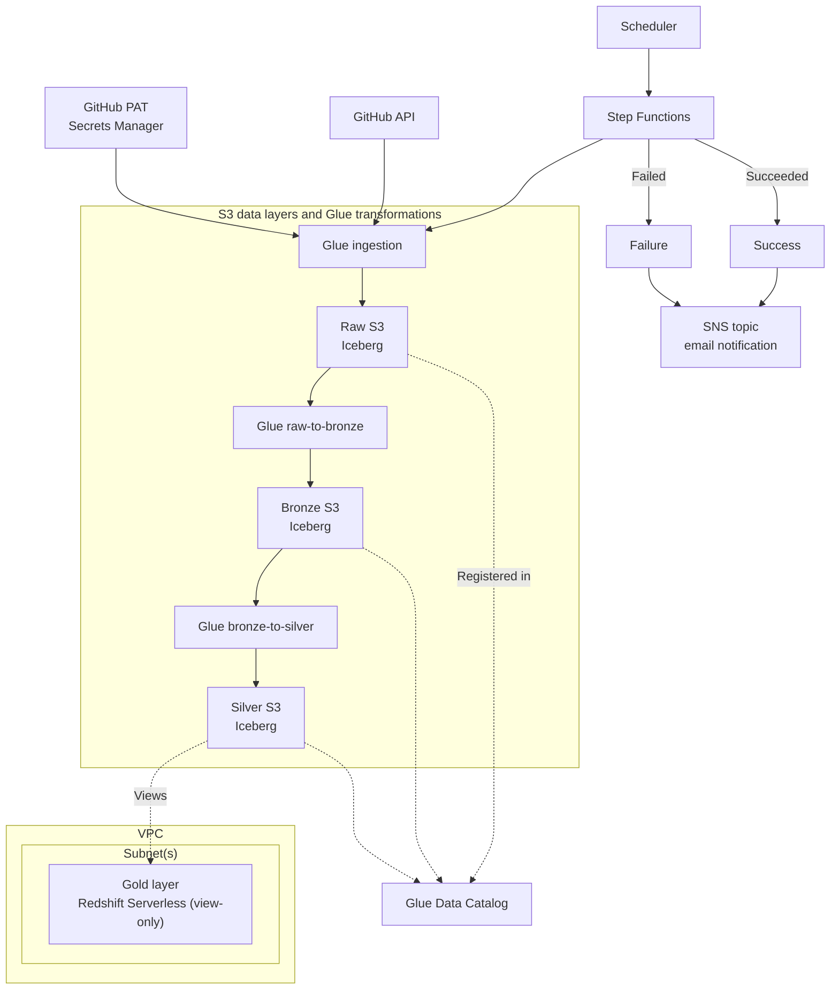

# Project Architecture

## DevOps: infrastructure and application deployment

```mermaid
flowchart TB
    subgraph FIRST["1. One-time account setup"]
        OIDC["Configure GitHub OIDC provider<br/>in AWS account"]
        SETUP["Run setup_stack in CloudFormation<br/>once for the first environment"]
        AWSROLE["Creates account-level CICD IAM role"]
        OIDC --> SETUP --> AWSROLE
    end

    subgraph INFRA["2. Deploy infrastructure"]
        IR["Infrastructure repo<br/>push to environment-specific branch"] --> IWF["GitHub Actions"]
        IWF -->|"Assume role via OIDC"| AWSROLE
        IWF --> NETWORK["Networking stack<br/>VPC, subnets, security group"]
        NETWORK --> STORAGE["Storage stack<br/>S3, Glue Catalog, secrets, Redshift"]
        STORAGE --> COMPUTE["Compute stack<br/>Glue, Step Functions, scheduler, SNS"]
    end

    subgraph APPDEPLOY["3. Deploy application code"]
        AR["Application repo<br/>push to environment-specific branch"] --> AWF["GitHub Actions<br/>build wheel and job scripts"]
        AWF -->|"Assume role via OIDC"| AWSROLE
        AWF --> UPLOAD["Upload package and scripts"]
        UPLOAD --> SOURCE["Source-code S3 bucket"]
    end

    STORAGE -. "Creates" .-> SOURCE
    COMPUTE -. "Deploy infrastructure before application code" .-> AWF
```

## Data engineering architecture

```mermaid
flowchart TB
    SCHEDULER["Scheduler"] --> SF["Step Functions"]
    SF -->|Succeeded| SUCCESS["Success"]
    SF -->|Failed| FAILURE["Failure"]
    SUCCESS --> SNS["SNS topic<br/>email notification"]
    FAILURE --> SNS

    SF --> INGEST
    GITHUB["GitHub API"] --> INGEST["Glue ingestion"]
    SECRET["GitHub PAT<br/>Secrets Manager"] --> INGEST

    subgraph PIPELINE["S3 data layers and Glue transformations"]
        direction LR
        INGEST --> RAW["Raw S3<br/>Iceberg"]
        RAW --> BRONZEJOB["Glue raw-to-bronze"]
        BRONZEJOB --> BRONZE["Bronze S3<br/>Iceberg"]
        BRONZE --> SILVERJOB["Glue bronze-to-silver"]
        SILVERJOB --> SILVER["Silver S3<br/>Iceberg"]
    end

    CATALOG["Glue Data Catalog"]
    RAW -. "Registered in" .-> CATALOG
    BRONZE -.-> CATALOG
    SILVER -.-> CATALOG

    SILVER -. "Views" .-> GOLD

    subgraph VPC["VPC"]
        subgraph SUBNET["Subnet(s)"]
            GOLD["Gold layer<br/>Redshift Serverless (view-only)"]
        end
    end
```
